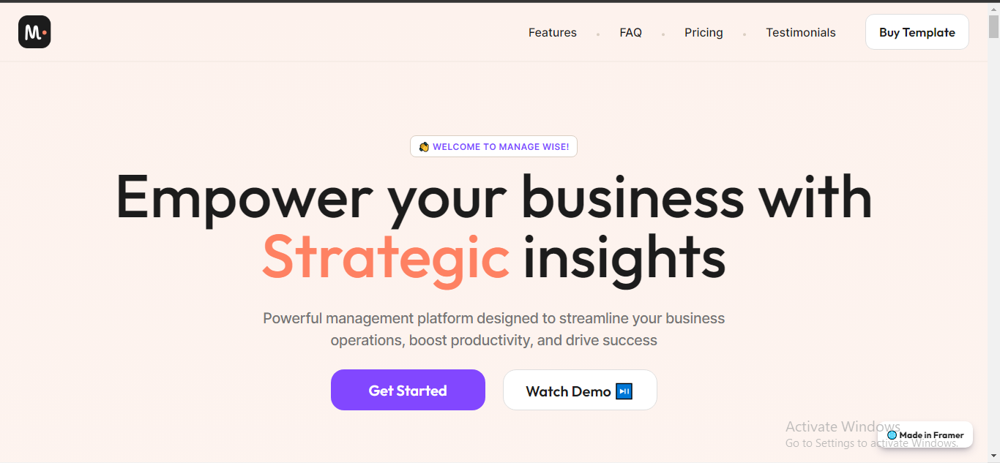

# Manage Wise - SaaS Product Landing Page

## Description

This is a 3-day task for entry into an internship program. It's basically a clone of the one of the site's homepage, given to the applicants by the interning company - HireQuotient. The site that clone - this particular task is this (ManageWise - managewise.framer.website)

I built this with HTML, vanilla CSS and JavaScript ([W3C HTML Living Standard](https://html.spec.whatwg.org/multipage/), [ WHATWG HTML Living Standard](https://html.spec.whatwg.org/multipage/), [W3C CSS Working Group](https://www.w3.org/Style/CSS/), [MDN Web Docs - CSS](https://developer.mozilla.org/en-US/docs/Web/CSS),  [https://developer.mozilla.org/en-US/docs/Web/JavaScript](https://developer.mozilla.org/en-US/docs/Web/JavaScript)) .

### Display

This task is hosted with GitHub pages. Take a look at it [here](https://chivicoko.github.io/hirequotient.com_managewise.framer.website/)
